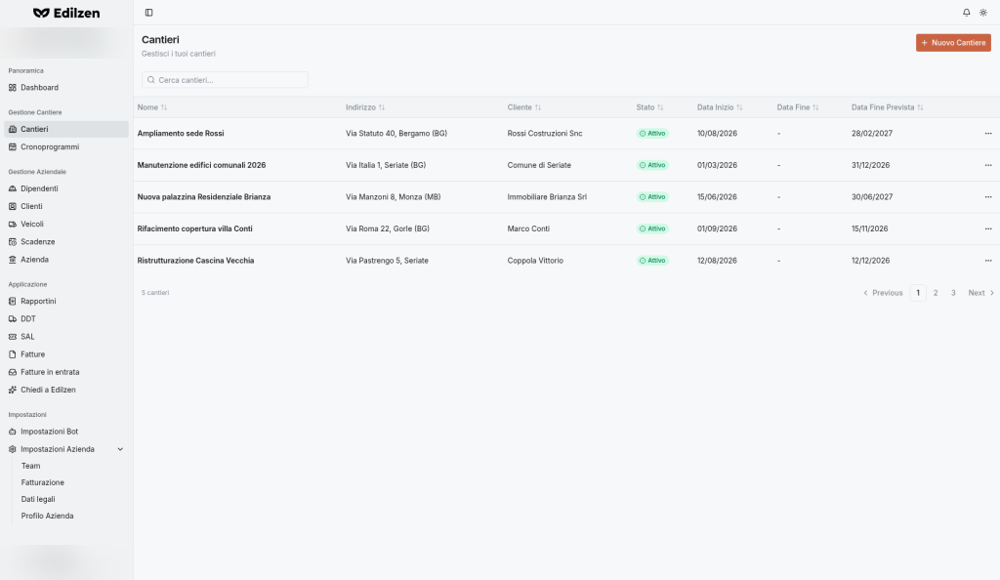
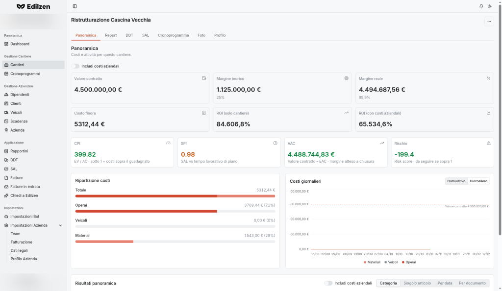
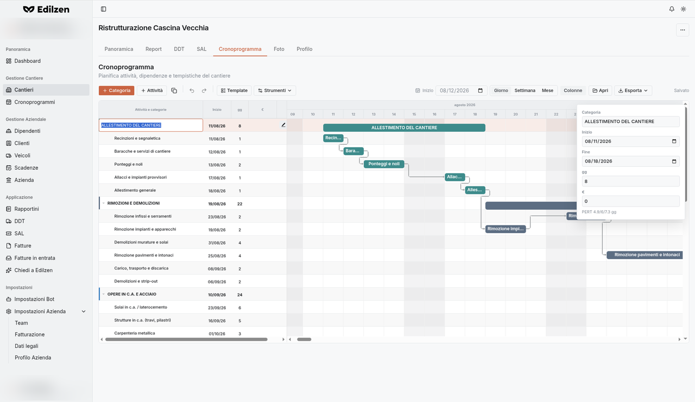
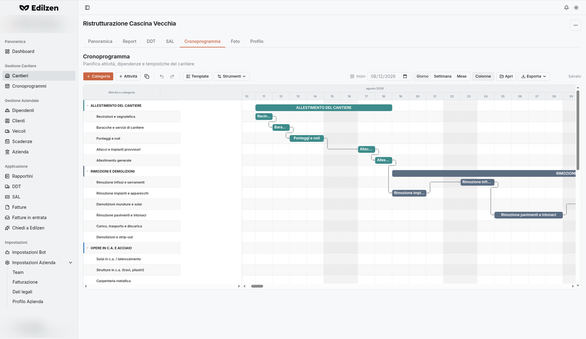
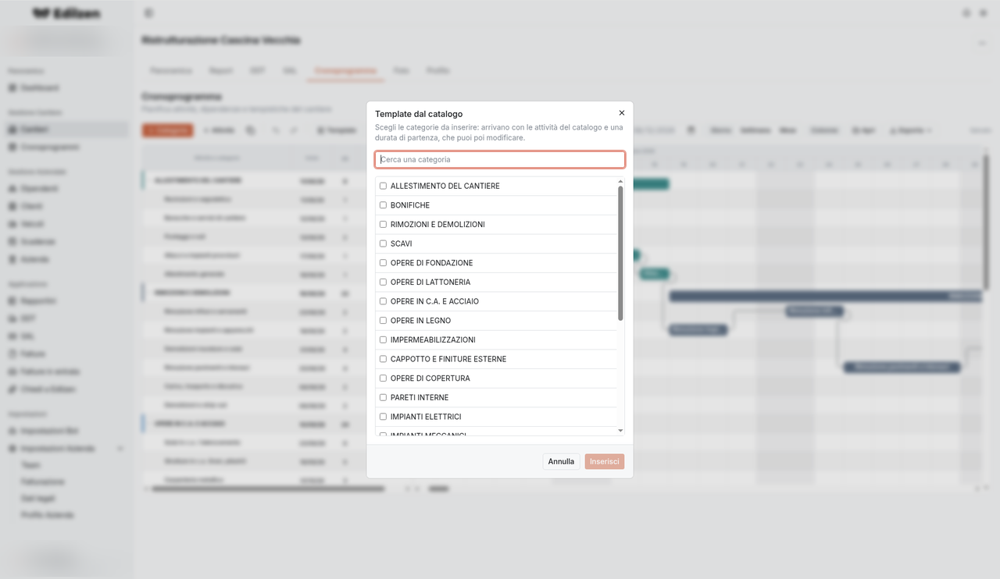

# Cantieri

**Percorso:** Gestione Cantiere › Cantieri (`/worksites`)

Il cantiere è l'entità centrale di Edilzen: a ogni cantiere si collegano cliente, costi del personale, veicoli e materiali, rapportini, DDT, SAL, cronoprogramma e foto.

## Cosa trovi in questa pagina

- [Elenco cantieri](#elenco-cantieri): colonne, ricerca, ordinamento, menu di riga;
- [Creare un cantiere](#creare-un-cantiere): campi, obbligatorietà, messaggi;
- [Modificare ed eliminare](#modificare-un-cantiere);
- [Scheda di dettaglio](#scheda-di-dettaglio-del-cantiere) con le 7 schede: Panoramica, Report, DDT, SAL, Cronoprogramma, Foto, Profilo.

## Elenco cantieri

*"Cantieri – Gestisci i tuoi cantieri".*

{ .screenshot }

### Controlli

| Controllo | Cosa fa |
|-----------|---------|
| **Nuovo Cantiere** (arancione, in alto a destra) | Apre la pagina di creazione `/worksites/create` |
| **Cerca cantieri…** | Filtra l'elenco per testo |
| Intestazioni di colonna | Ordinano l'elenco (1° clic crescente, 2° decrescente, 3° ordine predefinito) |
| Clic sulla riga | Apre la scheda del cantiere |
| **⋯ › Vedi Dettagli** | Apre la scheda del cantiere (scheda *Panoramica*) |
| **⋯ › Modifica** | Apre il modulo di modifica `/worksites/<id>/edit` |
| Paginazione | Conteggio (*N cantieri*), **Previous**, numeri di pagina, **Next** |

### Colonne

| Colonna | Contenuto |
|---------|-----------|
| **Nome** | Nome del cantiere |
| **Indirizzo** | Ubicazione |
| **Cliente** | Committente |
| **Stato** | Badge di stato (es. *Attivo*) |
| **Data Inizio** | Data di apertura |
| **Data Fine** | Data di chiusura effettiva ("-" se in corso) |
| **Data Fine Prevista** | Data di fine pianificata |

## Creare un cantiere

Pagina **Crea Cantiere · Aggiungi un nuovo cantiere** (`/worksites/create`).

### Procedura

1. In **Cantieri** premi **Nuovo Cantiere**.
2. Compila la sezione **Informazioni Cantiere**.
3. (Facoltativo) compila **Codici Identificativi**.
4. Imposta almeno la **Data Inizio** in **Periodo di Attività**.
5. Premi **Crea Cantiere**.

### Campi

| Sezione | Campo | Obbligatorio | Note |
|---------|-------|:------------:|------|
| **Informazioni Cantiere** – *Inserisci nome e indirizzo del cantiere* | **Nome** | ✔ | Almeno 2 caratteri |
| | **Indirizzo** | ✔ | Almeno 2 caratteri |
| | **Cliente** | | Testo libero con suggerimenti dall'[anagrafica clienti](clienti.md) |
| | **Valore contratto** (€) | | Base per margini, ROI e VAC |
| | **Margine target** (%) | | Margine obiettivo |
| **Codici Identificativi** – *codici amministrativi opzionali usati per abbinare questo cantiere alle fatture in entrata* | **CIG** | | Codice Identificativo Gara |
| | **CUP** | | Codice Unico di Progetto |
| | **Riferimento amministrativo** | | Altro riferimento (es. commessa) |
| **Periodo di Attività** | **Data Inizio** | ✔ | Pulsante *Scegli una data* → calendario |
| | **Data Fine** | | |
| | **Data Fine Prevista** | | Usata come fine pianificata |

### Messaggi di validazione

| Regola | Messaggio mostrato |
|--------|--------------------|
| Nome di almeno 2 caratteri | `Name must be at least 2 characters long` |
| Indirizzo di almeno 2 caratteri | `Address must be at least 2 characters long` |
| Data Inizio obbligatoria | `Date is required` |

!!! tip
    Inserisci **CIG/CUP** quando li conosci: sono usati per abbinare al cantiere le fatture in entrata.

## Modificare un cantiere

Due modi equivalenti:

- dall'elenco: **⋯ › Modifica** (`/worksites/<id>/edit`);
- dalla scheda del cantiere: scheda **[Profilo](#profilo)**.

Modifica i campi e premi **Salva Modifiche**.

## Eliminare un cantiere

1. Apri la scheda del cantiere.
2. Premi **⋯** in alto a destra → **Elimina**.

!!! warning
    L'eliminazione rimuove il cantiere: verifica prima che non ci siano dati che vuoi conservare.

## Scheda di dettaglio del cantiere

Intestazione: nome del cantiere e pulsante **⋯** (voce **Elimina**). Sette schede, ognuna con il proprio indirizzo:

| Scheda | Indirizzo | Contenuto |
|--------|-----------|-----------|
| [Panoramica](#panoramica) | `/overview` | Indicatori economici, EVM, ripartizione e analisi costi |
| [Report](#report) | `/report-stats` | Statistiche e rapportini del cantiere |
| [DDT](#ddt) | `/ddt` | DDT del cantiere |
| [SAL](#sal) | `/sal` | SAL del cantiere |
| [Cronoprogramma](#cronoprogramma-gantt) | `/chronoprogram` | Gantt |
| [Foto](#foto) | `/photos` | Galleria |
| [Profilo](#profilo) | `/profile` | Modifica dati |

### Panoramica

*"Costi e attività per questo cantiere."*

{ .screenshot }

**Controlli**

| Controllo | Cosa fa |
|-----------|---------|
| Interruttore **Includi costi aziendali** (in alto) | Aggiunge ai costi del cantiere la quota di costi aziendali (criterio scelto in [Profilo azienda](profilo-azienda.md)) e aggiorna margini e indicatori |
| **Cumulativo / Giornaliero** (grafico *Costi giornalieri*) | Mostra i costi sommati nel tempo oppure giorno per giorno |
| **Categoria / Singolo articolo / Per data / Per documento** (*Risultati panoramica*) | Cambia il raggruppamento della tabella dei costi |
| Selettore di periodo (*Risultati panoramica*, predefinito **1m Questo mese**) | Limita la tabella al periodo scelto (opzioni in [Comportamenti comuni](comportamenti-comuni.md#selettore-di-periodo)) |
| Interruttore **Includi costi aziendali** (in *Risultati panoramica*) | Include i costi aziendali anche nella tabella |

**Indicatori economici**

| Riquadro | Significato |
|----------|-------------|
| **Valore contratto** | Importo contrattuale |
| **Margine teorico** | Margine previsto (€ e %) |
| **Margine reale** | Valore contratto meno costi effettivi (€ e %) |
| **Costo finora** | Totale dei costi registrati |
| **ROI (solo cantiere)** | Ritorno sui soli costi diretti |
| **ROI (con costi aziendali)** | Ritorno includendo la quota di costi aziendali |

**Indicatori EVM**

| Riquadro | Descrizione mostrata |
|----------|----------------------|
| **CPI** | EV / AC · sotto 1 = costi sopra il guadagnato |
| **SPI** | SAL vs tempo lavorativo di piano |
| **VAC** | Valore contratto − EAC · margine atteso a chiusura |
| **Rischio** | Risk score del cantiere |

**Ripartizione costi** – Totale e suddivisione **Operai**, **Veicoli**, **Materiali**, in € e %.

**Costi giornalieri** – grafico per Materiali, Veicoli, Operai con la linea orizzontale **Valore contratto** come riferimento.

**Stato vuoto**: se nel periodo non ci sono costi, la tabella mostra *"Nessun costo registrato"*.

### Report

*"Statistiche Report · Report e attività per questo cantiere."*

| Elemento | Cosa fa / mostra |
|----------|------------------|
| **Aggiungi Report** | Apre la creazione rapportino con il cantiere già selezionato (`/reports/create/bot?worksiteId=…`) |
| **Report** | Numero di rapportini |
| **Ore lavorate** | Totale ore |
| **Distanza** (km) | Km percorsi dai veicoli |
| **Ultimo report** | Data dell'ultimo rapportino |
| Tabella | **Numero** (#n), **Data**, **Dipendenti**, **Liberi professionisti**, **Veicoli**, **Costo** |

### DDT

*"DDT (Documenti di Trasporto) caricati o creati per questo cantiere."*

- **Aggiungi DDT** → modulo di creazione DDT con il cantiere preimpostato (`/ddts/create/form?worksiteId=…`).
- Tabella: **Numero**, **Data**, **P.IVA**, **Righe**.

### SAL

*"Stato di Avanzamento Lavori ancorato al cronoprogramma del cantiere."*

- **Nuovo SAL** → creazione SAL con il cantiere preimpostato (`/sal/create?worksiteId=…`); vedi [SAL](sal.md#creare-un-sal).
- Tabella: **Data**, **Percentuale**; conteggio *N voce/voci* e paginazione.

### Cronoprogramma (Gantt)

*"Pianifica attività, dipendenze e tempistiche del cantiere".* A sinistra la **griglia** delle attività, a destra il **diagramma di Gantt** (weekend ombreggiati). Le modifiche si salvano automaticamente: a destra della barra strumenti compare **Salvato**.

{ .screenshot }

#### Barra strumenti

| Controllo | Cosa fa |
|-----------|---------|
| **+ Categoria** | Aggiunge una categoria (macro‑fase) |
| **+ Attività** | Aggiunge un'attività (lavorazione) |
| **Duplica** (icona) | Duplica l'elemento selezionato |
| **Annulla / Ripeti** (frecce) | Annulla o ripristina l'ultima modifica |
| **Template** | Apre *Template dal catalogo* |
| **Strumenti ▾** | Menu: Squadre, Rese e quantità, Attese, Adatta la timeline, Vai a oggi |
| **Inizio** | Data di inizio del cantiere da cui parte la pianificazione |
| **Giorno / Settimana / Mese** | Scala temporale del Gantt |
| **Colonne** | Mostra/nasconde le colonne *Inizio*, *gg*, *€* della griglia (per lasciare più spazio al Gantt) |
| **Apri** | Importa un cronoprogramma da file `.json` |
| **Esporta ▾** | Esporta in **JSON**, **PNG**, **SVG** o **PDF** |
| **Salvato** | Indicatore di salvataggio automatico |

{ .screenshot }

#### Griglia attività

| Colonna | Contenuto |
|---------|-----------|
| **Attività e categorie** | Albero: categorie (espandibili/comprimibili con la freccia) e attività |
| **Inizio** | Data di inizio |
| **gg** | Durata in giorni |
| **€** | Importo |

Passando il mouse su una riga compaiono le icone **Modifica** (matita) ed **Elimina**.

#### Modificare una categoria o un'attività

1. Passa il mouse sulla riga e premi la **matita** (*Modifica*).
2. Il nome diventa modificabile direttamente nella griglia e si apre un pannello laterale con: **Categoria**/nome, **Inizio**, **Fine**, **gg**, **€** e il suggerimento **PERT** (es. *PERT 4.9/6/7.3 gg* = ottimistica / più probabile / pessimistica).
3. Modifica i valori: il Gantt si aggiorna e la modifica viene salvata.
4. Premi <kbd>Esc</kbd> per annullare la modifica in corso.

Per eliminare: icona **Elimina** sulla riga.

#### Creare dipendenze

Trascina la maniglia all'estremità di una barra **sulla lavorazione di destinazione**: si crea una dipendenza **FS** (*Finish‑to‑Start*, la seconda inizia quando finisce la prima), visualizzata come freccia. Il collegamento **SAL xx%** sul Gantt porta alla scheda SAL.

#### Template dal catalogo

{ .screenshot }

*"Scegli le categorie da inserire: arrivano con le attività del catalogo e una durata di partenza, che puoi poi modificare."*

1. Premi **Template** (oppure **Applica template** se il cronoprogramma è vuoto).
2. Usa **Cerca una categoria** per filtrare l'elenco.
3. Spunta le categorie desiderate.
4. Premi **Inserisci** (o **Annulla** per chiudere senza modifiche).

Categorie disponibili: Allestimento del cantiere · Bonifiche · Rimozioni e demolizioni · Scavi · Opere di fondazione · Opere di lattoneria · Opere in c.a. e acciaio · Opere in legno · Impermeabilizzazioni · Cappotto e finiture esterne · Opere di copertura · Pareti interne · Impianti elettrici · Impianti meccanici · Impianti speciali · Ascensori e sollevamento · Sottofondi · Pavimenti e rivestimenti · Controsoffitti · Serramenti esterni · Serramenti interni · Finiture interne · Sistemazioni esterne · Smobilizzo del cantiere.

#### Menu Strumenti

=== "Squadre"

    *"Imposta gli operai di default e, se serve, gli scostamenti per categoria o singola attività. Alla conferma durate e date si ricalcolano sulle dipendenze."*

    | Controllo | Cosa fa |
    |-----------|---------|
    | **Default cantiere — operai** | Numero di operai predefinito per tutte le lavorazioni |
    | **Applica a tutte le barre** | Applica il valore di default a tutte le righe |
    | **Mostra anche attività (N)** | Mostra nella tabella anche le singole attività, non solo le categorie |
    | Tabella **Lavorazione / Operai / Etichetta squadra** | Scostamenti per categoria o attività e nome della squadra |
    | **Annulla / Applica squadre** | Chiude senza modifiche / conferma e ricalcola durate e date |

=== "Rese e quantità"

    *"Quantità di computo e rese di catalogo restano il riferimento. Modificandole, alla conferma le durate si ricalcolano con Q / (resa × operai) e le barre si riposizionano sulle dipendenze."*

    | Colonna / controllo | Significato |
    |---------------------|-------------|
    | **Attività** | Lavorazione |
    | **Q base** / **Quantità** | Quantità di computo di riferimento / quantità effettiva |
    | **UM** | Unità di misura |
    | **Resa base** / **Resa** | Resa di catalogo / resa effettiva |
    | **Operai** | Numero di operai |
    | **gg** | Durata risultante = Q / (resa × operai) |
    | **Ripristina i valori di computo** | Riporta quantità e rese ai valori di riferimento |

=== "Attese"

    *"Attese tra categorie": giorni lavorativi di attesa tra una categoria e la successiva (stagionatura, maturazione, asciugatura).*

    1. In **Dopo la categoria** scegli la categoria (*Scegli una categoria*) – *"Finita questa categoria, aspetta N giorni prima di iniziare la successiva."*
    2. Indica i giorni di attesa.
    3. Salva: i ritardi (lag) delle dipendenze FS vengono ricalcolati e le barre riposizionate.

    Sabato, domenica e festivi restano comunque vuoti, anche con attesa 0.

=== "Adatta la timeline"

    Adatta lo zoom del Gantt in modo da vedere l'intero cronoprogramma.

=== "Vai a oggi"

    Scorre il Gantt fino alla data odierna.

#### Esportare e importare

- **Esporta ▾ › JSON** – file riutilizzabile (reimportabile con **Apri**);
- **Esporta ▾ › PNG / SVG** – immagine del Gantt;
- **Esporta ▾ › PDF** – documento stampabile;
- **Apri** – seleziona un file `.json` per caricare un cronoprogramma.

#### Cronoprogramma vuoto

Se il cantiere non ha ancora un cronoprogramma compare *"Il cronoprogramma è vuoto — Aggiungi una categoria oppure parti da un template del catalogo lavori."* con i pulsanti **Aggiungi categoria** e **Applica template**.

### Foto

*"Immagini del cantiere."*

1. Premi **Aggiungi Foto**.
2. Seleziona una o più immagini dal computer (sono accettati i file immagine; selezione multipla consentita).
3. Le foto compaiono nella galleria.

Stato vuoto: *"Nessuna foto — Carica foto di questo cantiere per vederle qui."*

### Profilo

Modulo di modifica del cantiere, con pulsante **Salva Modifiche**.

| Sezione | Campi |
|---------|-------|
| **Informazioni Cantiere** | Nome, Indirizzo, Cliente (facoltativo), **Latitudine**, **Longitudine** (facoltativi) |
| **Codici Identificativi** | CIG, CUP, Riferimento amministrativo |
| **Valore contratto** – *Imposta il valore totale del contratto per questo cantiere* | Valore contratto (€), Margine target (%) |
| **Stato** – *Imposta lo stato attuale del cantiere* | **Attivo**, **Completato**, **Sospeso**, **Cancellato** |
| **Periodo di Attività** | Data Inizio, Data Fine, Data Fine Prevista |

Latitudine e longitudine posizionano il cantiere sulla *Mappa cantieri* della [Dashboard](dashboard.md#mappa-cantieri).

!!! tip "Chiudere un cantiere"
    A lavori finiti imposta **Stato = Completato** e la **Data Fine** nel Profilo.
