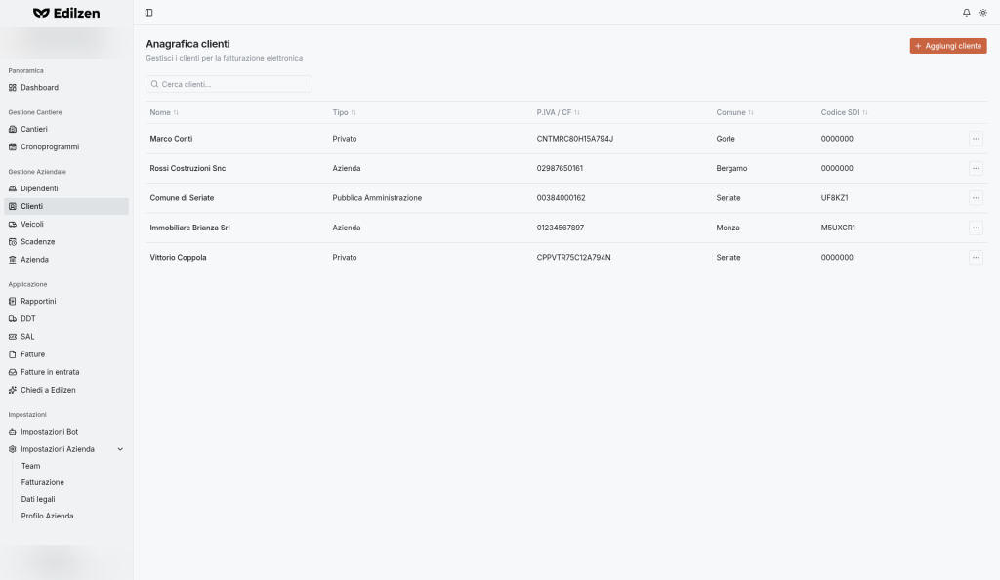

# Clienti

**Percorso:** Gestione Aziendale › Clienti (`/customers`)

*"Anagrafica clienti — Gestisci i clienti per la fatturazione elettronica".* I clienti sono i committenti dei cantieri e i destinatari delle [fatture](fatture.md).

## Cosa trovi in questa pagina

- [Elenco clienti](#elenco-clienti) e azioni di riga;
- [Aggiungere un cliente](#aggiungere-un-cliente): le 6 tipologie e i campi che ciascuna richiede;
- regole di validazione;
- [Modificare ed eliminare](#modificare-un-cliente).

{ .screenshot }

## Elenco clienti

| Controllo | Cosa fa |
|-----------|---------|
| **Aggiungi cliente** | Apre la finestra *Nuovo cliente* |
| **Cerca clienti…** | Ricerca per testo |
| Intestazioni di colonna | Ordinamento |
| Clic sulla riga / **⋯ › Vedi profilo** | Apre il profilo del cliente |
| **⋯ › Elimina** | Elimina il cliente |

| Colonna | Contenuto |
|---------|-----------|
| **Nome** | Ragione sociale o nome e cognome |
| **Tipo** | Privato, Azienda, Pubblica Amministrazione, … |
| **P.IVA / CF** | Partita IVA o codice fiscale |
| **Comune** | |
| **Codice SDI** | Codice destinatario |

## Aggiungere un cliente

### Procedura

1. Premi **Aggiungi cliente**.
2. Scegli la **Tipologia destinatario** (una delle 6 schede).
3. Compila **Anagrafica** (i campi cambiano con la tipologia).
4. Compila **Sede o residenza** e **Contatti digitali**.
5. Se serve, attiva **Aggiungi stabile organizzazione** e/o **Aggiungi rappresentante fiscale**.
6. Premi **Crea cliente**.

### Tipologie destinatario

*"Seleziona la tipologia di cliente a cui intestare le fatture."* La tipologia predefinita è **Azienda**.

| Tipologia | Descrizione mostrata | Campi anagrafici | Extra |
|-----------|----------------------|------------------|-------|
| **Privato** | Consumatori finali con Codice Fiscale e Codice Destinatario 0000000 | Nome, Cognome, Codice fiscale | Nessuna sezione stabile organizzazione / rappresentante |
| **Azienda** | Imprese con P.IVA e Codice Destinatario SdI a 7 caratteri | P.IVA, Codice fiscale (facoltativo), Denominazione | |
| **Libero Professionista** | P.IVA e dati personali (Nome e Cognome) | P.IVA, Nome, Cognome | |
| **Pubblica Amministrazione** | Enti pubblici con Codice Destinatario IPA a 6 caratteri e Split Payment | P.IVA, Codice fiscale, Codice IPA | Interruttore **Split payment** |
| **Condominio** | Codice Fiscale numerico a 11 cifre, privo di Partita IVA | Codice fiscale, Denominazione | Interruttore **Split payment** |
| **Estero (non residente)** | P.IVA estera (idPaese diverso da IT) o Codice Fiscale | P.IVA, Denominazione, Nome, Cognome | |

**Split payment** – *"Scissione dei pagamenti: l'IVA è versata direttamente dall'acquirente."*

### Sede o residenza

*"Compila i campi con l'indirizzo a cui intestare i documenti."* **Indirizzo**, **N. civico** (facoltativo), **CAP**, **Comune**, **Provincia**, **Nazione**.

### Contatti digitali

*"Codice destinatario SDI e PEC per l'invio della fattura elettronica."* **Codice destinatario**, **PEC destinatario** (facoltativo).

### Stabile organizzazione e rappresentante fiscale

| Interruttore | Campi che compaiono |
|--------------|---------------------|
| **Aggiungi stabile organizzazione** – *sede della stabile organizzazione in Italia, se presente* | Indirizzo, N. civico, CAP, Comune, Provincia, Nazione |
| **Aggiungi rappresentante fiscale** – *dati del rappresentante fiscale, se previsto* | Partita IVA, Denominazione, Nome, Cognome (facoltativi) |

### Messaggi di validazione

| Regola | Messaggio mostrato |
|--------|--------------------|
| P.IVA obbligatoria per la tipologia scelta | `VAT number is required for this customer type` |
| Serve almeno P.IVA o codice fiscale | `VAT number or tax code is required` |
| Denominazione obbligatoria per la tipologia | `Company name is required for this customer type` |
| Indirizzo e Comune obbligatori | `Too small: expected string to have >=1 characters` |
| CAP di 5 cifre | `CAP must be 5 digits` |
| Provincia obbligatoria per l'Italia | `Province is required for Italy` |
| Codice destinatario di almeno 6 caratteri | `Too small: expected string to have >=6 characters` |

Annullando con dati inseriti compare *"Scartare il nuovo cliente?"* (**Continua a modificare** / **Scarta**).

## Modificare un cliente

1. Apri il profilo (clic sulla riga o **⋯ › Vedi profilo**).
2. Nella scheda **Profilo** trovi lo stesso modulo della creazione, già compilato.
3. Modifica e premi **Salva modifiche**.

## Eliminare un cliente

**⋯ › Elimina** nell'elenco (o dal menu **⋯** del profilo).

## Codice SDI: promemoria

| Cliente | Codice destinatario |
|---------|--------------------|
| Privato | `0000000` (eventuale PEC) |
| Azienda / Libero professionista | Codice a 7 caratteri del canale di ricezione |
| Pubblica Amministrazione | Codice IPA a 6 caratteri |

!!! tip
    Un'anagrafica completa evita di reinserire i dati nel passaggio **Cliente** della [fattura](fatture.md#2-cliente).
