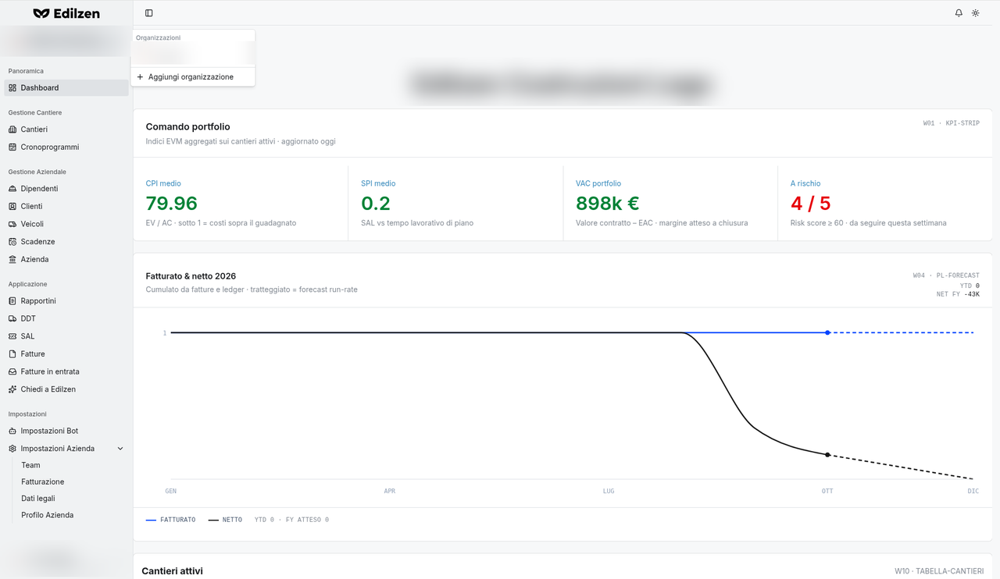
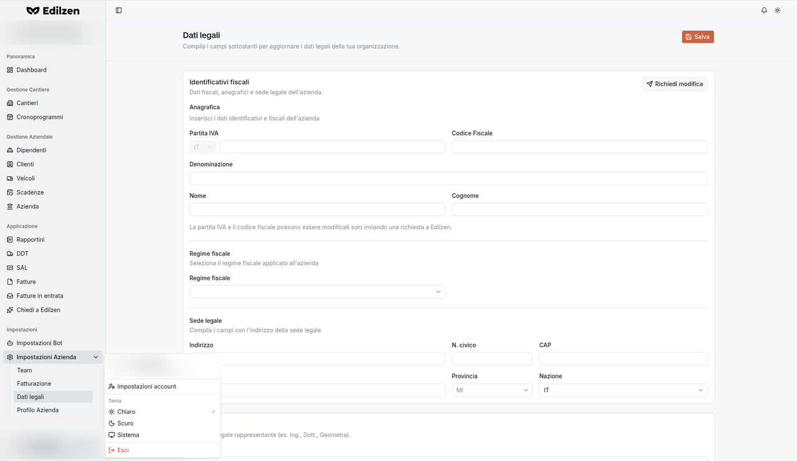
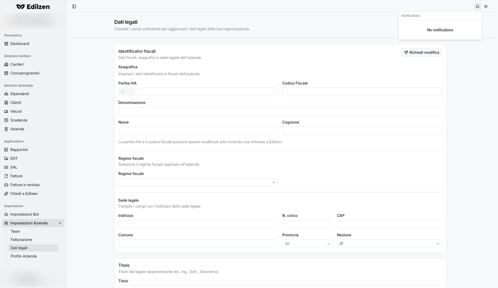
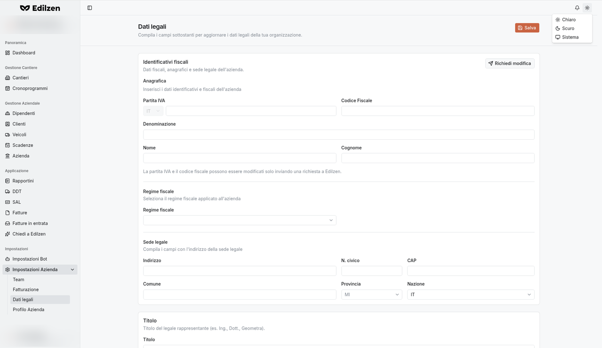

# Comportamenti comuni

Questa pagina descrive i comandi e i comportamenti che si ripetono in tutta l'applicazione. Le pagine delle singole sezioni vi fanno riferimento.

## Cosa trovi in questa pagina

- struttura del menu laterale e scorciatoia **Ctrl+B**;
- selettore dell'organizzazione e menu utente;
- barra superiore: notifiche e tema;
- elenchi: ricerca, ordinamento, menu di riga, paginazione;
- selettore di periodo;
- finestre di creazione, annullamento e conferma "Scartare…?";
- calendario di scelta data;
- scorciatoie da tastiera.

## Menu laterale (sidebar)

| Elemento | Cosa fa |
|----------|---------|
| **Selettore organizzazione** (in alto: nome azienda + email) | Apre il menu *Organizzazioni* (vedi sotto) |
| **Voci di menu** | Aprono la sezione corrispondente; la voce attiva è evidenziata |
| **Impostazioni Azienda ▾** | Gruppo comprimibile: un clic mostra/nasconde *Team, Fatturazione, Dati legali, Profilo Azienda* |
| **Menu utente** (in basso: iniziali, nome, email) | Apre il menu dell'utente (vedi sotto) |

### Comprimere il menu

- Pulsante **Mostra/nascondi sidebar** (icona in alto a sinistra della barra superiore): riduce il menu alle sole icone; un secondo clic lo riapre.
- Scorciatoia da tastiera **Ctrl+B**: stesso effetto.

## Selettore dell'organizzazione

{ .screenshot }

Cliccando sul nome dell'azienda in cima al menu si apre il menu **Organizzazioni**:

| Voce | Cosa fa |
|------|---------|
| Elenco delle **altre organizzazioni** a cui hai accesso | Seleziona l'organizzazione su cui lavorare |
| **+ Aggiungi organizzazione** | Avvia la creazione di una nuova organizzazione |

## Menu utente

{ .screenshot }

| Voce | Cosa fa |
|------|---------|
| Intestazione (iniziali, nome, email) | Mostra l'utente collegato |
| **Impostazioni account** | Apre le impostazioni dell'account personale (vedi [Note e limitazioni](note-limitazioni.md)) |
| **Tema › Chiaro / Scuro / Sistema** | Imposta il tema; il segno ✓ indica quello attivo |
| **Esci** | Disconnette l'utente (logout) |

## Barra superiore

| Pulsante | Cosa fa |
|----------|---------|
| **Mostra/nascondi sidebar** (a sinistra) | Comprime/espande il menu laterale (anche con **Ctrl+B**) |
| **Notifiche** (campanella) | Apre il riquadro delle notifiche; se non ce ne sono, il riquadro è vuoto |
| **Cambia tema** (sole/luna) | Apre il menu **Chiaro / Scuro / Sistema** |

*Sistema* segue l'impostazione chiaro/scuro del sistema operativo. Le notifiche temporanee (conferme, errori) compaiono in sovrimpressione; l'area è raggiungibile con <kbd>Alt</kbd> + <kbd>T</kbd>.

{ .screenshot }

{ .screenshot }

## Elenchi

### Ricerca

Il campo **Cerca…** sopra la tabella (es. *Cerca cantieri…*, *Cerca DDT…*) filtra le righe in base al testo inserito.

### Ordinamento

Le intestazioni di colonna con le frecce ⇅ sono ordinabili:

1. **primo clic** → ordine crescente (A→Z, dal più piccolo, dal meno recente);
2. **secondo clic** → ordine decrescente;
3. **terzo clic** → torna all'ordine predefinito.

### Clic sulla riga e menu ⋯

- **Clic su una riga** → apre il dettaglio dell'elemento.
- **⋯** a fine riga → apre un menu a tendina con le azioni disponibili (es. *Vedi profilo*, *Modifica*, *Elimina*). Le voci sono descritte nella pagina di ciascuna sezione.

### Paginazione

In fondo alla tabella: conteggio totale (es. *5 cantieri*, *N voci*), **Previous**, numeri di pagina, **Next**. I pulsanti sono disattivati quando non c'è un'altra pagina.

### Stati vuoti

Quando una tabella non ha righe compare un messaggio esplicativo, spesso con l'invito all'azione (es. *"Nessun bot — Inizia creando un nuovo bot."*). Quando sono attivi filtri che non producono risultati compare un messaggio del tipo *"Non ci sono … che corrispondono ai filtri selezionati."*

## Selettore di periodo

Presente nell'elenco Rapportini, nelle statistiche di dipendenti e veicoli e nella Panoramica del cantiere. Opzioni:

| Etichetta | Periodo |
|-----------|---------|
| **1m** Questo mese | mese corrente (predefinito) |
| **1s** Questa settimana | settimana corrente |
| **1a** Questo anno | anno corrente |
| **1g** Oggi | solo oggi |
| **7g** Ultimi 7 giorni | |
| **31g** Ultimi 31 giorni | |
| **365g** Ultimi 365 giorni | |
| **Intervallo personalizzato** | scegli data di inizio e fine |

## Creazione di nuovi elementi

Il pulsante arancione in alto a destra di ogni elenco crea un nuovo elemento:

| Tipo | Sezioni |
|------|---------|
| **Finestra di dialogo** (l'indirizzo della pagina riceve `?action=new`) | Dipendenti, Clienti, Veicoli |
| **Pagina dedicata** (`…/create`) | Cantieri, Rapportini, DDT, SAL, Fatture |
| **Assistente AI (chat)** in alternativa al modulo | Rapportini, DDT |

### Annullare una creazione

Premendo **Annulla** (o <kbd>Esc</kbd>) dopo aver inserito dei dati compare la conferma **"Scartare il nuovo …?"** – *Non hai ancora salvato… Se chiudi ora, le informazioni inserite andranno perse.*

- **Continua a modificare** → torna al modulo senza perdere nulla;
- **Scarta** → chiude e perde i dati inseriti.

### Campi obbligatori e validazione

Premendo il pulsante di conferma con campi mancanti o non validi, i messaggi d'errore compaiono sotto i campi interessati e l'elemento non viene salvato. Le regole di ciascun modulo sono elencate nelle relative pagine. I campi segnati *(facoltativo)* possono restare vuoti.

## Scelta delle date

I pulsanti **Scegli una data** aprono un calendario con menu a tendina per **mese** (Gennaio…Dicembre) e **anno**. Clic sul giorno per selezionarlo. Alcuni campi data hanno una **×** (*Cancella data*) per svuotarli.

## Scorciatoie da tastiera

| Tasti | Effetto |
|-------|---------|
| <kbd>Ctrl</kbd> + <kbd>B</kbd> | Mostra/nasconde il menu laterale |
| <kbd>Esc</kbd> | Chiude finestre di dialogo, menu e riquadri a comparsa; nel cronoprogramma annulla la modifica in corso |
| <kbd>Alt</kbd> + <kbd>T</kbd> | Porta il focus sull'area notifiche |

!!! tip
    I pulsanti a sola icona (campanella, tema, sidebar, ⋯) non mostrano un suggerimento al passaggio del mouse: fai riferimento alle tabelle di questa pagina.
