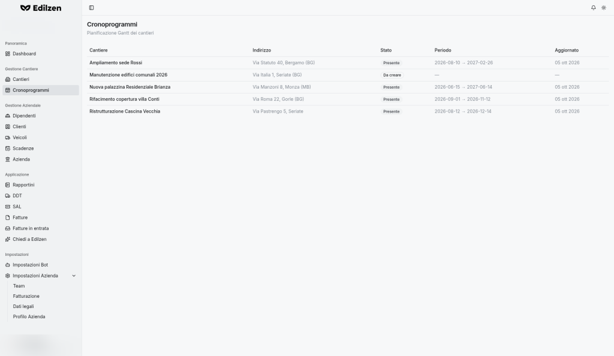

# Cronoprogrammi

**Percorso:** Gestione Cantiere › Cronoprogrammi (`/chronoprograms`)

*"Pianificazione Gantt dei cantieri".* Elenco di tutti i cantieri con lo stato del rispettivo cronoprogramma.

{ .screenshot }

## Cosa trovi in questa pagina

| Colonna | Contenuto |
|---------|-----------|
| **Cantiere** | Nome del cantiere |
| **Indirizzo** | Ubicazione |
| **Stato** | **Presente** = cronoprogramma già creato · **Da creare** = cantiere senza pianificazione |
| **Periodo** | Data di inizio → data di fine pianificata ("—" se da creare) |
| **Aggiornato** | Data dell'ultima modifica |

La pagina non ha pulsanti propri.

## Azioni

| Azione | Risultato |
|--------|-----------|
| **Clic su una riga** | Apre la scheda **Cronoprogramma** del cantiere (`/worksites/<id>/chronoprogram`) |

## Creare il cronoprogramma di un cantiere "Da creare"

1. Clicca sulla riga del cantiere con stato **Da creare**.
2. Compare *"Il cronoprogramma è vuoto — Aggiungi una categoria oppure parti da un template del catalogo lavori."*
3. Scegli:
    - **Applica template** → seleziona le categorie dal catalogo e premi **Inserisci**; oppure
    - **Aggiungi categoria** → costruisci il piano manualmente.
4. Adatta date, durate e dipendenze. Il salvataggio è automatico; tornando in questa pagina lo stato sarà **Presente**.

Tutte le funzioni del Gantt (barra strumenti, template, strumenti, esportazione) sono descritte in [Cantieri › Cronoprogramma](cantieri.md#cronoprogramma-gantt).

!!! tip
    Usa questa pagina per individuare i cantieri **Da creare**: il cronoprogramma è il riferimento per SAL e SPI.
