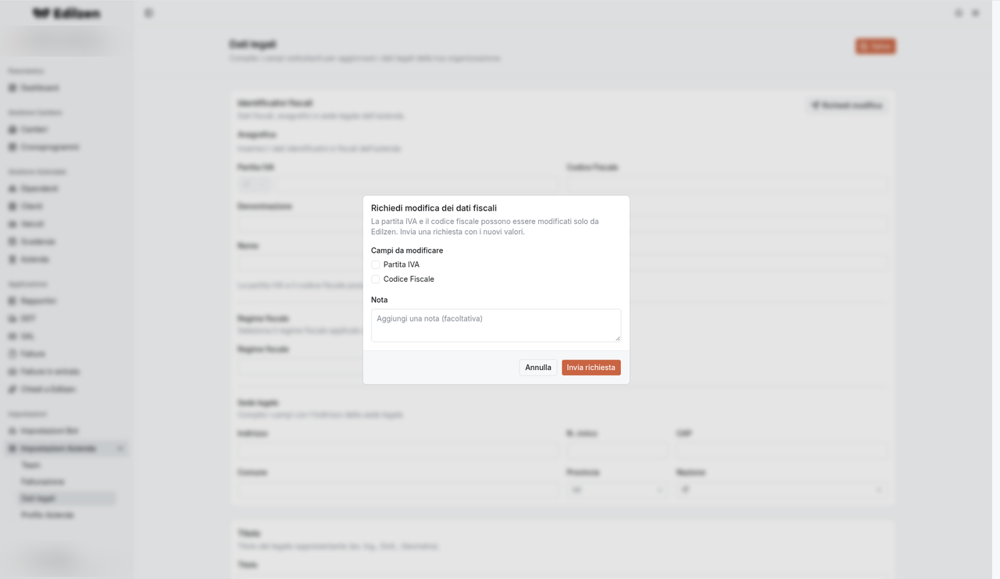

# Dati legali

**Percorso:** Impostazioni › Impostazioni Azienda › Dati legali (`/settings/legal-data`)

*"Compila i campi sottostanti per aggiornare i dati legali della tua organizzazione."* Sono i dati dell'azienda come **mittente** delle fatture elettroniche. Secondo la pagina [Team](team.md), sono controllati dai **Titolari**.

## Cosa trovi in questa pagina

| Controllo | Cosa fa |
|-----------|---------|
| **Salva** (in alto a destra) | Salva tutte le modifiche della pagina |
| **Richiedi modifica** (sezione *Identificativi fiscali*) | Invia a Edilzen la richiesta di cambiare P.IVA e/o codice fiscale |
| Menu **Regime fiscale**, **Provincia**, **Nazione**, **Socio unico**, **Stato liquidazione** | Scelta da elenco |

## Procedura: aggiornare i dati legali

1. Compila o correggi i campi delle sezioni sotto.
2. Premi **Salva**.

## Identificativi fiscali

*"Dati fiscali, anagrafici e sede legale dell'azienda."*

**Anagrafica**: **Partita IVA** (con prefisso paese), **Codice Fiscale**, **Denominazione**, **Nome**, **Cognome**.

*"La partita IVA e il codice fiscale possono essere modificati solo inviando una richiesta a Edilzen."* I due campi sono bloccati.

### Richiedere la modifica di P.IVA o codice fiscale

{ .screenshot }

1. Premi **Richiedi modifica**.
2. Nella finestra *"Richiedi modifica dei dati fiscali"* spunta i **Campi da modificare**: **Partita IVA** e/o **Codice Fiscale**, e inserisci i nuovi valori.
3. (Facoltativo) scrivi una **Nota**.
4. Premi **Invia richiesta** (o **Annulla**).

## Regime fiscale

*"Seleziona il regime fiscale applicato all'azienda."*

| Codice | Regime |
|--------|--------|
| RF01 | Ordinario |
| RF02 | Contribuenti minimi |
| RF04 | Agricoltura e attività connesse e pesca |
| RF05 | Vendita sali e tabacchi |
| RF06 | Commercio fiammiferi |
| RF07 | Editoria |
| RF08 | Gestione servizi telefonia pubblica |
| RF09 | Rivendita documenti di trasporto pubblico e di sosta |
| RF10 | Intrattenimenti |
| RF11 | Agenzie viaggi e turismo |
| RF12 | Agriturismo |
| RF13 | Vendite a domicilio |
| RF14 | Rivendita beni usati, d'arte, d'antiquariato |
| RF15 | Agenzie di vendite all'asta |
| RF16 | IVA per cassa P.A. |
| RF17 | IVA per cassa |
| RF18 | Altro |
| RF19 | Regime forfettario |
| RF20 | Regime transfrontaliero di Franchigia IVA |

!!! tip
    La maggior parte delle imprese edili usa **RF01 Ordinario**; le ditte individuali in regime forfettario **RF19**.

## Altre sezioni

| Sezione | Campi / opzioni |
|---------|-----------------|
| **Sede legale** | Indirizzo, N. civico, CAP, Comune, **Provincia** (109, sigla + nome), **Nazione** (249 paesi) |
| **Titolo** | *Titolo del legale rappresentante (es. Ing., Dott., Geometra)* |
| **Codice EORI** | *Numero di registrazione e identificazione degli operatori economici* |
| **Iscrizione REA** – *dati di iscrizione al registro imprese* | Ufficio, Numero REA, Capitale sociale, **Socio unico** (*SU – Socio Unico* / *SM – Socio Multiplo*), **Stato liquidazione** (*LS – In Liquidazione* / *LN – Non In Liquidazione*) |
| **Albo professionale** | Albo professionale, Provincia albo, Numero iscrizione, Data iscrizione |
| **Stabile organizzazione** – *sede della stabile organizzazione dell'azienda* | Indirizzo, N. civico, CAP, Comune, Provincia, Nazione |
| **Contatti** – *telefono, fax ed email* | Telefono, Fax, Email |
| **Riferimento amministrazione** | *Codice di riferimento dell'amministrazione* |

!!! tip
    Mantieni questi dati aggiornati: si ripercuotono su tutte le fatture emesse.
