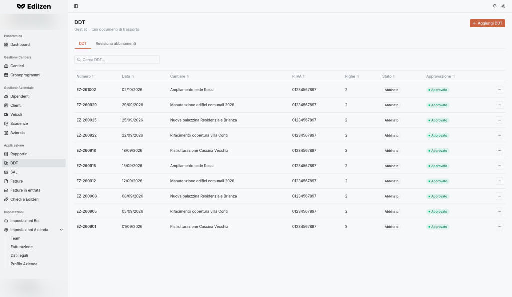

# DDT – Documenti di trasporto

**Percorso:** Applicazione › DDT (`/ddts`)

*"DDT — Gestisci i tuoi documenti di trasporto".* Ogni DDT è associato a un **cantiere di destinazione**: le sue righe diventano costo del cantiere (voce *Materiali*) e vengono abbinate agli articoli della fattura del fornitore ([Fatture in entrata](fatture-in-entrata.md)).

## Cosa trovi in questa pagina

- [Elenco DDT](#scheda-ddt) e azioni di riga;
- [Revisiona abbinamenti](#revisiona-abbinamenti);
- [Creare un DDT](#creare-un-ddt) caricando il documento (Assistente AI) o con il modulo;
- [Dettaglio](#dettaglio-del-ddt), [modifica](#modificare-un-ddt), PDF ed eliminazione.

{ .screenshot }

## Scheda DDT

| Controllo | Cosa fa |
|-----------|---------|
| **Aggiungi DDT** | Apre la creazione (`/ddts/create/bot`, modalità Assistente AI) |
| Schede **DDT** / **Revisiona abbinamenti** | Passano tra elenco e revisione |
| **Cerca DDT…** | Ricerca per testo |
| Intestazioni di colonna | Ordinamento |
| Clic sulla riga / **⋯ › Visualizza** | Apre il dettaglio |
| **⋯ › Scarica PDF** | Scarica il DDT in PDF |
| **⋯ › Elimina** | Elimina il DDT |

| Colonna | Contenuto |
|---------|-----------|
| **Numero** | Numero del DDT |
| **Data** | |
| **Cantiere** | Cantiere di destinazione |
| **P.IVA** | Partita IVA del fornitore |
| **Righe** | Numero di righe |
| **Stato** | Stato di abbinamento con la fattura (es. **Abbinato**) |
| **Approvazione** | Es. **Approvato** |

## Revisiona abbinamenti

Abbina le **righe dei DDT** agli **articoli delle fatture ricevute**: qui compaiono i DDT che richiedono una verifica rispetto alla fattura.

Stato vuoto: *"Nessun DDT da revisionare — Ogni DDT è completamente abbinato o in attesa di una fattura ricevuta."*

La stessa revisione è disponibile in [Fatture in entrata › Abbinamento](fatture-in-entrata.md#abbinamento). I DDT con anomalie di prezzo compaiono anche nel widget *DDT da revisionare* della [Dashboard](dashboard.md#ddt-da-revisionare).

## Creare un DDT

Pagina *"Crea un DDT con l'assistente AI o compilando il modulo manualmente"*, con il selettore **Assistente AI (Chat) · Veloce** / **Modulo manuale (Form)**.

=== "Assistente AI (Chat)"

    *"Carica un DDT per iniziare: l'assistente estrae i dati e ti chiede conferma passo passo."*

    1. Trascina il file nell'area **Trascina qui il tuo DDT**, oppure clicca l'area per sceglierlo dal computer.
    2. Formati accettati: **PDF, JPG, JPEG, PNG, WEBP** (anche la foto del DDT cartaceo).
    3. L’assistente **estrae i dati** del documento e ti chiede **conferma passo per passo**.
    4. Conferma o correggi i dati proposti.

=== "Modulo manuale (Form)"

    | Campo | Obbl. | Note |
    |-------|:-----:|------|
    | **Cantiere** | ✔ | Elenco ricercabile (nome + indirizzo) |
    | **Numero** | | Numero del DDT |
    | **P.IVA** | | Del fornitore |
    | **CF** | | Del fornitore |
    | **Numero fattura** | | *(facoltativo)* fattura del fornitore |
    | **Data** | | *Scegli una data* |
    | **Righe** | | *"Aggiungi le righe di merce trasportate dal DDT."* – pulsante **Aggiungi riga** |

    Premi **Crea DDT**.

    | Regola | Messaggio mostrato |
    |--------|--------------------|
    | Cantiere obbligatorio | `Worksite is required` |

Dalla scheda **DDT** di un cantiere, **Aggiungi DDT** apre il modulo con il cantiere già selezionato.

## Dettaglio del DDT

Titolo **"DDT #&lt;numero&gt;"**, pulsanti **Modifica**, **Scarica PDF**, **Elimina**; scheda **Panoramica**.

| Elemento | Contenuto |
|----------|-----------|
| **Numero DDT**, **Data** | |
| **Affidabilità** | Affidabilità dei dati estratti dall'assistente AI (es. *Media*) |
| **Approvazione** | Stato di approvazione |
| **Cantiere di destinazione** | Nome, indirizzo, pulsante **Apri scheda cantiere** |
| **Fattura collegata** | Esito dell'abbinamento (es. *Corrispondenza completa*) e fattura |
| **Dati fornitore** | P.IVA, CF |
| **File** | Documento caricato (o *"Nessun file caricato"*) |
| **Righe** | **Codice**, **Descrizione**, **Quantità**, **Unità**, con pulsante **Modifica** |

## Modificare un DDT

1. **Modifica** nel dettaglio (`/ddts/<id>/edit`).
2. Modifica Cantiere, Numero, P.IVA, CF, Numero fattura, Data.
3. Nella sezione **Righe** ogni *Riga n* ha: **Codice**, **Codici articolo**, **Descrizione**, **Quantità**, **Unità**; **Aggiungi riga** per aggiungerne.
4. Premi **Aggiorna DDT**.

## Scaricare il PDF ed eliminare

- **Scarica PDF**: dal menu ⋯ dell'elenco o dal dettaglio.
- **Elimina**: dal menu ⋯ dell'elenco o dal dettaglio.

## Stati di un DDT

- **Stato** – se il DDT è **abbinato** alla fattura del fornitore;
- **Approvazione** – se il DDT è **approvato**. I DDT inviati dai [bot](bot.md) possono essere approvati automaticamente se l'opzione è attiva sul bot.
