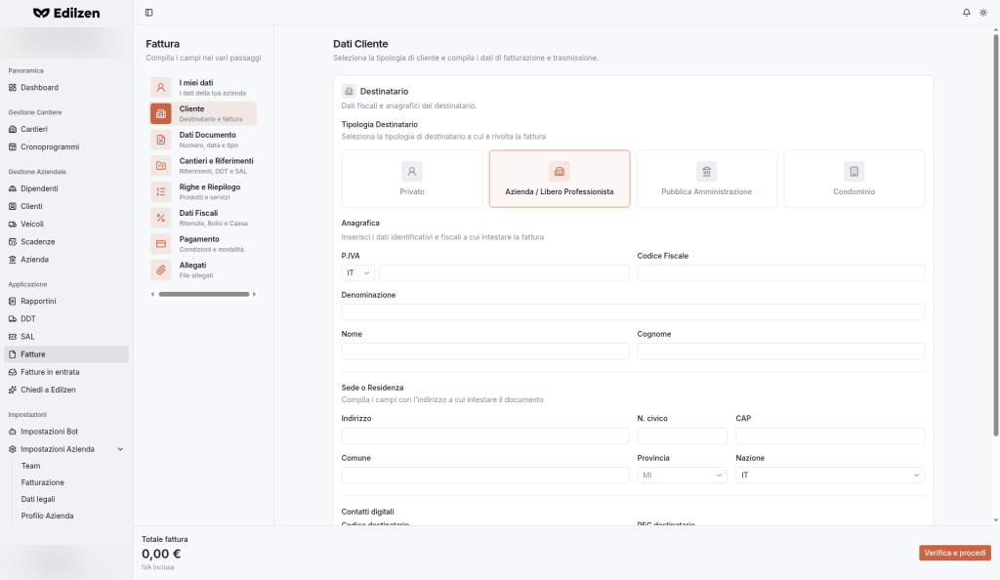
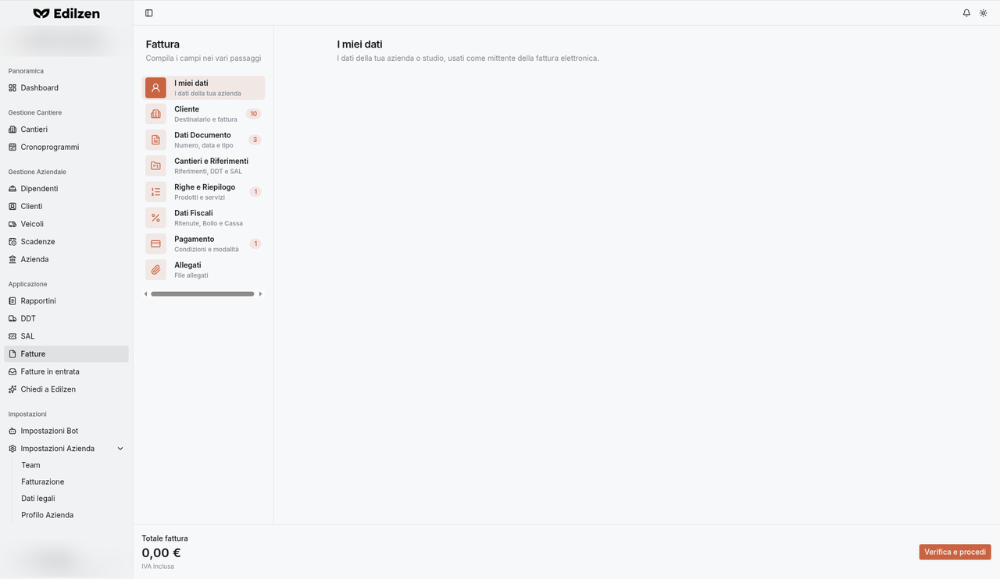

# Fatture

**Percorso:** Applicazione › Fatture (`/invoices`)

*"Fatture — Gestisci le tue fatture".* Da qui si emettono le **fatture elettroniche** verso i clienti con una procedura guidata in 8 passaggi.

## Cosa trovi in questa pagina

- [Elenco fatture](#elenco-fatture);
- [Funzionamento della procedura guidata](#la-procedura-guidata) (navigazione, totale, verifica, badge di errore);
- i passaggi [1](#1-i-miei-dati) · [2](#2-cliente) · [3](#3-dati-documento) · [4](#4-cantieri-e-riferimenti) · [5](#5-righe-e-riepilogo) · [6](#6-dati-fiscali-e-casse) · [7](#7-pagamento) · [8](#8-allegati), con **tutti i menu a tendina** e i messaggi di validazione;
- le [tabelle dei codici](#tabelle-dei-codici): TD, Valuta, IVA, Natura, RT, Causali, TC, TP, MP.

## Elenco fatture

| Controllo | Cosa fa |
|-----------|---------|
| **Nuova fattura** | Apre la procedura guidata (`/invoices/create`) |

Se non ci sono fatture la pagina mostra solo intestazione e pulsante.

## La procedura guidata

{ .screenshot }

| Elemento | Cosa fa |
|----------|---------|
| **Elenco passaggi** (a sinistra) | Ogni passaggio è una scheda cliccabile: puoi spostarti **liberamente in qualsiasi ordine**. La procedura si apre sul passaggio **Cliente** |
| **Badge rosso** accanto al passaggio | Dopo una verifica, indica il numero di errori presenti in quel passaggio (es. *Cliente 10*, *Dati Documento 3*) |
| **Totale fattura** (in basso a sinistra) | Totale IVA inclusa, aggiornato in tempo reale |
| **Verifica e procedi** (in basso a destra) | Controlla tutti i dati; se ci sono errori li evidenzia nei campi e nei badge |

I dati inseriti restano memorizzati passando da un passaggio all'altro.

{ .screenshot }

| # | Passaggio | Sottotitolo |
|---|-----------|-------------|
| 1 | I miei dati | I dati della tua azienda |
| 2 | Cliente | Destinatario e fattura |
| 3 | Dati Documento | Numero, data e tipo |
| 4 | Cantieri e Riferimenti | Riferimenti, DDT e SAL |
| 5 | Righe e Riepilogo | Prodotti e servizi |
| 6 | Dati Fiscali | Ritenute, Bollo e Cassa |
| 7 | Pagamento | Condizioni e modalità |
| 8 | Allegati | File allegati |

### Procedura completa

1. **Fatture › Nuova fattura**.
2. Verifica i [dati legali](dati-legali.md) dell'azienda (mittente).
3. Passaggio **Cliente**: tipologia, anagrafica, sede, codice destinatario/PEC.
4. Passaggio **Dati Documento**: data, numero, tipo documento.
5. Passaggio **Cantieri e Riferimenti**: CIG/CUP, DDT, SAL se necessari.
6. Passaggio **Righe e Riepilogo**: aggiungi le righe; controlla il riepilogo IVA.
7. Passaggio **Dati Fiscali**: ritenute, bollo, cassa se applicabili.
8. Passaggio **Pagamento**: condizioni e modalità.
9. Passaggio **Allegati**: eventuali file.
10. Premi **Verifica e procedi** e correggi gli errori indicati dai badge.

### 1. I miei dati

*"I dati della tua azienda o studio, usati come mittente della fattura elettronica."* Il mittente corrisponde ai dati in [Impostazioni › Dati legali](dati-legali.md) (vedi anche [Note e limitazioni](note-limitazioni.md)).

### 2. Cliente

*"Dati Cliente: Seleziona la tipologia di cliente e compila i dati di fatturazione e trasmissione."*

**Tipologia Destinatario** – *"Seleziona la tipologia di destinatario a cui è rivolta la fattura"*:

| Tipologia | Campi anagrafici | Split Payment |
|-----------|------------------|:-------------:|
| **Privato** | Nome, Cognome | – |
| **Azienda / Libero Professionista** (predefinita) | P.IVA (prefisso paese, predefinito `IT`), Codice Fiscale, Denominazione, Nome, Cognome | ✔ |
| **Pubblica Amministrazione** | P.IVA, Codice Fiscale, Codice IPA | ✔ |
| **Condominio** | Codice Fiscale, Denominazione | ✔ |

| Sezione | Campi |
|---------|-------|
| **Sede o Residenza** | Indirizzo, N. civico, CAP, Comune, **Provincia** (109 province italiane, sigla + nome), **Nazione** (249 paesi, predefinito `IT`) |
| **Contatti digitali** | Codice destinatario, PEC destinatario |
| **Split Payment** | Interruttore – *"Scissione dei pagamenti: l'IVA è pagata dalla Pubblica Amministrazione."* |

**Messaggi di validazione**

| Messaggio | Significato |
|-----------|-------------|
| *La Partita IVA è obbligatoria se il prefisso Paese è presente* | Con un prefisso paese selezionato serve il numero di P.IVA |
| *La Partita IVA può contenere solo lettere maiuscole e numeri, senza spazi* | Formato P.IVA |
| *È obbligatorio inserire almeno la Partita IVA o il Codice Fiscale* | Serve almeno uno dei due |
| *Inserisci la Denominazione oppure Nome e Cognome* | Serve la ragione sociale oppure nome e cognome |
| `Invalid input…` su Indirizzo, CAP, Comune, Nazione | Campi obbligatori dell'indirizzo |
| *Codice destinatario non valido* | Codice SDI mancante o non valido |

### 3. Dati Documento

*"Numero, data e tipo di documento per identificare la fattura."*

| Campo | Obbl. | Note |
|-------|:-----:|------|
| **Data** | ✔ | *Scegli una data* |
| **Numero** | ✔ | Numero della fattura |
| **Tipo documento** | ✔ | Codici TD (vedi [tabella](#tipo-documento-td)) |
| **Causale** | | Descrizione libera |
| **Valuta** | | Predefinita **EUR** (vedi [tabella](#valuta)) |

**Fattura principale** – *"Riferimento alla fattura principale per DDT o fatture accompagnatorie"*: **Numero Fattura**, **Data Fattura**.

| Messaggio | Significato |
|-----------|-------------|
| `Invalid ISO date` | Data mancante o non valida |
| *Il numero documento è obbligatorio* | |
| *Campo obbligatorio* (Tipo documento) | |

### 4. Cantieri e Riferimenti

*"Collega la fattura ad appalti, stati avanzamento lavori (SAL) o documenti di trasporto."*

**Riferimenti** – *"Aggiungi uno o più riferimenti: CIG, CUP, commessa, ecc."*

1. Premi **Aggiungi riferimento**: compare *Riferimento n*.
2. Compila:

    | Campo | Note |
    |-------|------|
    | **Tipo riferimento** | **Ordine** (predefinito) · **Contratto** · **Convenzione** · **Ricezione** · **Fattura collegata** |
    | **Numero Documento** | Obbligatorio – *"Il Numero Documento è obbligatorio"* |
    | **Data Documento** | |
    | **Numero Item** | |
    | **Codici gara** | **Codice CIG**, **Codice CUP**, **Codice Commessa** |

3. Per eliminarlo: cestino **Rimuovi riferimento**.

Stato vuoto: *"Nessun riferimento — Aggiungi un ordine, un contratto o una convenzione collegati alla fattura."*

**Documenti di trasporto**

1. **Aggiungi DDT** → **Numero DDT** (obbligatorio: *"Il numero DDT è obbligatorio"*) e **Data DDT** (*"Formato data non valido (usa YYYY-MM-DD)"*).
2. **Rimuovi DDT** per toglierlo.

Stato vuoto: *"Nessun DDT — Aggiungi i documenti di trasporto allegati alla fattura."*

**SAL** – *"Stato avanzamento lavori: fasi di riferimento della fattura."*

1. **Aggiungi fase** → *Fase n* con **Riferimento Fase** (numero maggiore di 0: *"Il riferimento fase deve essere maggiore di 0"*).
2. **Rimuovi fase** per toglierla.

Stato vuoto: *"Nessuna fase SAL"*.

### 5. Righe e Riepilogo

*"Aggiungi prestazioni, materiali e sconti. Il riepilogo IVA viene calcolato in automatico."*

**Aggiungere una riga**

1. Premi **Aggiungi riga**: si apre *"Nuova riga — Prodotto o servizio da aggiungere alla fattura, con prezzo, IVA e dettagli."*
2. Compila:

    | Campo | Note |
    |-------|------|
    | **Descrizione** | |
    | **Quantità** | |
    | **UM** | Unità di misura (es. KG, M, PZ) |
    | **Prezzo unitario** (netto) | |
    | **IVA** | 22% Aliquota ordinaria (predefinita) · 10% ridotta · 5% super ridotta · 4% minima · 0% Non imponibile · Esente · Fuori campo |
    | **Totale riga (netto)** | Calcolato in tempo reale |

3. (Facoltativo) apri **Dettagli aggiuntivi**:

    | Sezione | Contenuto |
    |---------|-----------|
    | **Riferimenti linea** | **Tipo cessione prestazione**: SC Sconto · PR Premio · AB Abbuono · AC Spesa accessoria; **Ritenuta**; **Riferimento amministrazione** |
    | **Periodo di riferimento** | Data inizio / fine periodo |
    | **Sconti e maggiorazioni (riga)** | **Aggiungi sconto/maggiorazione** |
    | **Codici articolo** | **Aggiungi codice articolo** |
    | **Altri dati gestionali** | **Aggiungi dato gestionale** |

4. Premi **Aggiungi riga** (o **Cancella**).

Stato vuoto: *"Nessuna riga — Aggiungi una riga per iniziare."*

**Sconto / Maggiorazione (documento)** – *"Sconti o maggiorazioni applicati a livello documento: tipo, percentuale o importo."*

- **Tipo**: **SC - Sconto** · **MG - Maggiorazione**; **Percentuale %**; **Importo**.
- Messaggi: *"Campo obbligatorio"* (Tipo); *"Devi specificare almeno la Percentuale o l'Importo dello sconto/maggiorazione."*
- Stato vuoto: *"Nessuno sconto/maggiorazione"*.

**Dati di riepilogo** – *"Riepilogo per aliquota IVA: imponibili, imposte e dati integrativi."* Calcolato automaticamente; senza righe mostra *"Nessun dato — Aggiungi almeno una riga per visualizzare il riepilogo."*

### 6. Dati Fiscali e Casse

*"Gestisci casse previdenziali, ritenute d'acconto o a garanzia e marca da bollo."*

**Ritenuta** – *"Ritenuta d'acconto: tipo, aliquota, importo e causale pagamento."*

1. **Aggiungi ritenuta**.
2. Compila **Tipo Ritenuta** ([RT](#tipo-ritenuta-rt)), **Aliquota Ritenuta %** (> 0), **Importo Ritenuta** (> 0), **Causale Pagamento** ([causali](#causale-pagamento-ritenuta)).
3. Messaggi: *"L'aliquota deve essere maggiore di zero"*, *"L'importo della ritenuta deve essere maggiore di zero"*.

Stato vuoto: *"Nessuna ritenuta"*.

**Dati Bollo** – *"Marca da bollo: applicazione, importo e addebito al cliente."* Attiva **Applicazione Marca da Bollo** per far comparire **Importo Bollo**.

**Cassa previdenziale** – *"Contributi cassa previdenziale: tipo, importi, aliquota IVA e natura."*

1. **Aggiungi cassa previdenziale**.
2. Compila:

    | Campo | Note |
    |-------|------|
    | **Tipo Cassa** | Codici [TC](#tipo-cassa-tc) |
    | **Al Cassa %** | Aliquota del contributo |
    | **Importo Contributo** | Calcolato |
    | **Imponibile Cassa** | |
    | **Aliquota IVA %** | Stesse 7 opzioni delle righe |
    | **Ritenuta** | Interruttore: contributo soggetto a ritenuta |
    | **Natura IVA** | Obbligatoria se l'aliquota IVA è 0 – *"Se AliquotaIVA è 0, il campo Natura è obbligatorio"* ([Natura](#natura-iva)) |
    | **Riferimento Amministrazione** | |

Stato vuoto: *"Nessuna cassa previdenziale"*.

### 7. Pagamento

*"Metodo di Pagamento: Definisci come e quando il cliente dovrà pagare la fattura (IBAN, Rate, Scadenze)."*

1. Scegli le **Condizioni pagamento**: **TP01** Pagamento a rate · **TP02** Pagamento completo · **TP03** Anticipo.
2. Compaiono i campi:

    | Campo | Note |
    |-------|------|
    | **Modalità pagamento** | Obbligatoria – codici [MP](#modalita-pagamento-mp) |
    | **Scadenza** | Data |
    | **Importo** | |
    | **IBAN** | |
    | **Istituto finanziario** | |

3. (Facoltativo) **Dettagli aggiuntivi**:

    | Sezione | Campi |
    |---------|-------|
    | Riferimenti e Pubblica Amministrazione | Codice pagamento, Beneficiario diverso |
    | Sconto pagamento anticipato | %, Data limite |
    | Penale pagamento in ritardo | %, Data decorrenza |
    | Dati bancari esteri | BIC |
    | Dati bancari storici | ABI, CAB (per pagamenti tramite RIBA o MAV) |
    | Dati quietanze | Cognome, Nome, Titolo, CF del quietanzante |
    | Codice ufficio postale | |

### 8. Allegati

*"Allegati e Documenti: Carica file aggiuntivi come il PDF di cortesia, computi metrici o certificati SAL."*

1. Scrivi la **Descrizione**.
2. Premi **Aggiungi allegato** e seleziona il file.

*"La dimensione dei file è limitata — Il file non può superare i 3.5MB di dimensione."*

## Tabelle dei codici

### Tipo documento (TD)

| Codice | Descrizione |
|--------|-------------|
| TD01 | Fattura ordinaria / immediata |
| TD02 | Acconto/Anticipo su fattura |
| TD03 | Acconto/Anticipo su parcella |
| TD04 | Nota di credito |
| TD05 | Nota di debito |
| TD06 | Parcella |
| TD07 | Fattura semplificata |
| TD08 | Nota di credito semplificata |
| TD09 | Nota di debito semplificata |
| TD10 | Acquisto intracomunitario beni (uso residuo) |
| TD11 | Acquisto intracomunitario servizi (uso residuo) |
| TD12 | Documento riepilogativo art. 6 c. 1 DPR 695/96 |
| TD16 | Integrazione reverse charge interno |
| TD17 | Integrazione/Autofattura servizi dall'estero |
| TD18 | Integrazione acquisto beni intracomunitari |
| TD19 | Integrazione/Autofattura beni ex art. 17 c. 2 |
| TD20 | Autofattura per regolarizzazione / mancata ricezione |
| TD21 | Autofattura per splafonamento |
| TD22 | Estrazione beni da Deposito IVA |
| TD23 | Estrazione beni da Deposito IVA con versamento IVA |
| TD24 | Fattura differita con DDT o documentazione idonea |
| TD25 | Fattura differita per triangolazioni |
| TD26 | Cessione beni ammortizzabili / passaggi interni |
| TD27 | Autoconsumo o cessioni gratuite senza rivalsa |
| TD28 | Acquisti da San Marino con IVA – fattura cartacea |
| TD29 | Comunicazione operazioni estere da non residenti |

!!! tip
    Per un'impresa edile i codici più usati sono **TD01** (fattura immediata), **TD24** (fattura differita con DDT), **TD02** (acconto) e **TD04** (nota di credito).

### Valuta

EUR, GBP, CHF, NOK, SEK, DKK, PLN, CZK, HUF, USD, CAD, BRL, MXN, ARS, CLP, COP, JPY, CNY, INR, HKD, SGD, KRW, AED, SAR, ILS, AUD, NZD, ZAR, EGP, MAD.

### Aliquote IVA

22% Aliquota ordinaria · 10% Aliquota ridotta · 5% Aliquota super ridotta · 4% Aliquota minima · 0% Non imponibile · Esente · Fuori campo.

### Natura IVA

| Codice | Descrizione |
|--------|-------------|
| N1 | Escluse ex art. 15 |
| N2.1 | Non soggette – mancanza di territorialità |
| N2.2 | Non soggette – Regime forfettario e altri casi |
| N3.1 | Non imponibili – Esportazioni |
| N3.2 | Non imponibili – Cessioni intracomunitarie |
| N3.3 | Non imponibili – Cessioni verso San Marino |
| N3.4 | Non imponibili – Operazioni assimilate alle esportazioni |
| N3.5 | Non imponibili – A seguito di dichiarazione d'intento |
| N3.6 | Non imponibili – Altre operazioni non imponibili |
| N4 | Esenti ex art. 10 |
| N5 | Regime del margine / IVA non esposta in fattura |
| N6.1 | Inversione contabile – Cessione di rottami |
| N6.2 | Inversione contabile – Oro e argento puro |
| N6.3 | Inversione contabile – Subappalto nel settore edile |
| N6.4 | Inversione contabile – Cessione di fabbricati |
| N6.5 | Inversione contabile – Telefoni cellulari |
| N6.6 | Inversione contabile – Prodotti elettronici |
| N6.7 | Inversione contabile – Prestazioni comparto edile e settori affini |
| N6.8 | Inversione contabile – Operazioni settore energetico |
| N6.9 | Inversione contabile – Altri casi |
| N7 | IVA assolta in altro stato UE – Regime OSS/IOSS |

!!! tip
    Nel settore edile sono frequenti **N6.3** (subappalto) e **N6.7** (prestazioni comparto edile), con aliquota 0%.

### Tipo ritenuta (RT)

| Codice | Descrizione |
|--------|-------------|
| RT01 | Ritenuta d'acconto persone fisiche |
| RT02 | Ritenuta d'acconto persone giuridiche |
| RT03 | Contributo INPS |
| RT04 | Contributo ENASARCO |
| RT05 | Contributo ENPAM |
| RT06 | Altro contributo previdenziale |

### Causale pagamento (ritenuta)

| Codice | Descrizione |
|--------|-------------|
| A | Lavoro autonomo abituale |
| B | Diritti d'autore (da autore) |
| C | Associazione in partecipazione (solo lavoro) |
| D | Utili soci promotori / fondatori |
| E | Levata protesti (segretari comunali) |
| F | Indennità giudici di pace e VPO |
| G | Indennità cessazione attività CAF |
| H | Indennità cessazione agenzia (PF/SP) |
| I | Indennità cessazione funzioni notarili |
| L | Diritti d'autore (da terzi) |
| L1 | Premi per invenzioni industriali |
| M | Lavoro autonomo occasionale |
| M1 | Obblighi di fare, non fare, permettere |
| M2 | Lavoro occasionale (con ritenuta 20%) |
| N | Compensi e rimborsi sport dilettantistico |
| O | Autonomo occasionale all'estero (non residenti) |
| O1 | Obblighi di fare all'estero (non residenti) |
| P | Noleggio beni mobili a non residenti |
| Q | Provvigioni agente monomandatario |
| R | Provvigioni agente plurimandatario |
| S | Provvigioni a commissionario |
| T | Provvigioni a mediatore |
| U | Provvigioni procacciatore d'affari |
| V | Incaricati per vendite a domicilio |
| W | Corrispettivi appalti condominiali |
| X | Ricercatori e studenti stranieri |
| Y | Prestazioni sportivi professionisti |
| ZO | Altre indennità / titolo diverso |

### Tipo cassa (TC)

| Codice | Cassa |
|--------|-------|
| TC01 | Avvocati e procuratori legali |
| TC02 | Dottori commercialisti |
| TC03 | Geometri |
| TC04 | Ingegneri e architetti |
| TC05 | Notariato |
| TC06 | Ragionieri e periti commerciali |
| TC07 | ENASARCO |
| TC08 | ENPACL |
| TC09 | ENPAM |
| TC10 | ENPAF |
| TC11 | ENPAV |
| TC12 | ENPAIA |
| TC13 | Fondo previdenza impiegati imprese di spedizione e agenzie marittime |
| TC14 | INPGI |
| TC15 | ONAOSI |
| TC16 | CASAGIT |
| TC17 | EPPI |
| TC18 | EPAP |
| TC19 | ENPAB |
| TC20 | ENPAPI |
| TC21 | ENPAP (psicologi) |
| TC22 | INPS |

### Condizioni pagamento (TP)

| Codice | Descrizione |
|--------|-------------|
| TP01 | Pagamento a rate |
| TP02 | Pagamento completo |
| TP03 | Anticipo |

### Modalità pagamento (MP)

| Codice | Descrizione |
|--------|-------------|
| MP01 | Contanti |
| MP02 | Assegno |
| MP03 | Assegno circolare |
| MP04 | Contanti presso Tesoreria |
| MP05 | Bonifico |
| MP06 | Vaglia cambiario |
| MP07 | Bollettino bancario |
| MP08 | Carta di pagamento |
| MP09 | RID |
| MP10 | RID utenze |
| MP11 | RID veloce |
| MP12 | RIBA |
| MP13 | MAV |
| MP14 | Quietanza erario |
| MP15 | Giroconto su conti di contabilità speciale |
| MP16 | Domiciliazione bancaria |
| MP17 | Domiciliazione postale |
| MP18 | Bollettino di c/c postale |
| MP19 | SEPA Direct Debit |
| MP20 | SEPA Direct Debit B2B |
| MP21 | SEPA Direct Debit CORE |
| MP22 | Trattenute su somme già riscosse |
| MP23 | PagoPA |

I codici del **regime fiscale** (RF01–RF20) si impostano in [Dati legali](dati-legali.md#regime-fiscale).
