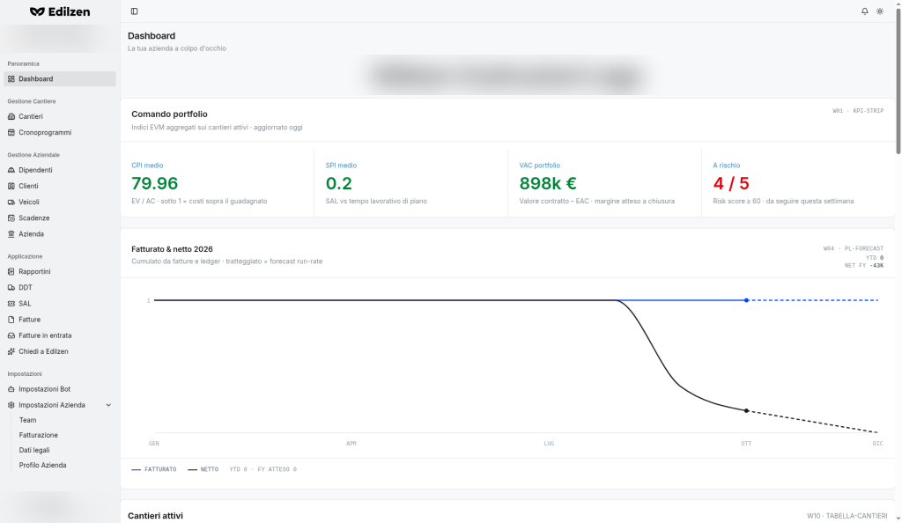

# Edilzen – Documentazione utente

Benvenuto nella guida di **Edilzen** (`app.edilzen.com`), la piattaforma gestionale per imprese edili che riunisce in un unico ambiente cantieri, pianificazione, personale, documenti di trasporto, stati di avanzamento, fatturazione elettronica e analisi economica.

Questa documentazione è **generalista ma precisa**: descrive ogni sezione dell'applicazione, a cosa serve, quali informazioni mostra e quali azioni permette.

## Cosa puoi fare con Edilzen

| Area | Cosa ci trovi |
|------|---------------|
| [Dashboard](dashboard.md) | Indicatori di portafoglio (CPI, SPI, VAC, rischio), fatturato e netto, burn rate, quadrante CPI×SPI, meteo, mappa cantieri, DDT anomali |
| [Cantieri](cantieri.md) | Anagrafica dei cantieri e scheda di dettaglio con costi, report, DDT, SAL, cronoprogramma, foto e profilo |
| [Cronoprogrammi](cronoprogrammi.md) | Elenco dei cronoprogrammi (Gantt) di tutti i cantieri |
| [Personale](personale.md) | Dipendenti e liberi professionisti, calcolo automatico del costo orario, cedolini |
| [Clienti](clienti.md) | Anagrafica clienti per la fatturazione elettronica |
| [Veicoli](veicoli.md) e [Scadenze](scadenze.md) | Parco mezzi e scadenze aziendali |
| [Azienda](azienda.md) | Panoramica aziendale, costi e ore interne |
| [Rapportini](rapportini.md) | Rapportini giornalieri, anche tramite assistente AI o bot |
| [DDT](ddt.md) | Documenti di trasporto con estrazione automatica dei dati e revisione degli abbinamenti |
| [SAL](sal.md) | Stati di avanzamento dal cronoprogramma o manuali |
| [Fatture](fatture.md) | Emissione di fatture elettroniche con procedura guidata in 8 passaggi |
| [Fatture in entrata](fatture-in-entrata.md) | Fatture dei fornitori e loro abbinamento |
| [Chiedi a Edilzen](chiedi-a-edilzen.md) | Assistente conversazionale sui dati aziendali |
| [Bot](bot.md) | Configurazione dei bot Telegram e WhatsApp |
| [Team](team.md) | Utenti, ruoli e livelli di accesso |

{ .screenshot }

## Come è organizzata la guida

1. **[Navigazione generale](navigazione.md)** e **[Comportamenti comuni](comportamenti-comuni.md)** – struttura del menu, ricerca, ordinamento, tema, notifiche, menu utente, scorciatoie.
2. **Sezioni operative** – una pagina per ogni voce del menu laterale, nello stesso ordine dell'applicazione.
3. **Impostazioni** – bot, team, fatturazione, dati legali e profilo dell'azienda.
4. **[Glossario](glossario.md)** – significato di sigle e indicatori (CPI, SPI, VAC, SAL, DDT, PERT, risk score…).
5. **[FAQ e flussi tipici](faq.md)** – i percorsi di lavoro più comuni, passo per passo.
6. **[Note e limitazioni](note-limitazioni.md)** – aree in sviluppo e azioni automatiche da conoscere.

Ogni pagina di sezione si apre con **Cosa trovi in questa pagina**, seguita dalla tabella dei controlli (pulsanti, menu, filtri, interruttori), dalle procedure passo passo, dai campi obbligatori con i messaggi di validazione e dagli stati vuoti.

!!! info "Ambito"
    La guida descrive le funzioni dell'interfaccia web. I valori mostrati nelle schermate sono dati di esempio.
