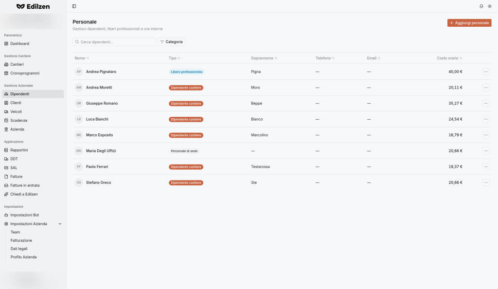

# Personale (Dipendenti)

**Percorso:** Gestione Aziendale › Dipendenti (`/employees`)

*"Personale — Gestisci dipendenti, liberi professionisti e ore interne".* Raccoglie tutte le persone che lavorano per l'azienda. Il **costo orario** di ciascuna è la base con cui Edilzen valorizza le ore lavorate nei cantieri.

## Cosa trovi in questa pagina

- [Elenco e filtri](#elenco-del-personale);
- [Aggiungere una persona](#aggiungere-una-persona) (dipendente o libero professionista) con tutti i campi e le regole;
- [Calcolo del costo orario](#calcolo-del-costo-orario);
- [Profilo della persona](#profilo-della-persona): schede Report, Cedolini, Profilo;
- [Eliminare una persona](#eliminare-una-persona).

{ .screenshot }

## Elenco del personale

### Controlli

| Controllo | Cosa fa |
|-----------|---------|
| **Aggiungi personale** | Apre la finestra *Crea nuovo dipendente* |
| **Cerca dipendenti…** | Ricerca per testo |
| **Categoria** (filtro) | Riquadro a selezione multipla con conteggi: **Dipendenti cantiere (n)**, **Personale di sede (n)**, **Liberi professionisti (n)**. Spunta una o più categorie per limitare l'elenco |
| Intestazioni di colonna | Ordinamento |
| Clic sulla riga | Apre il profilo |
| **⋯ › Vedi profilo** | Apre il profilo della persona |
| **⋯ › Elimina** | Elimina la persona |

### Colonne

| Colonna | Contenuto |
|---------|-----------|
| **Nome** | Nome e cognome, con iniziali |
| **Tipo** | **Dipendente cantiere**, **Personale di sede**, **Libero professionista** |
| **Soprannome** | Alias usato da bot e rapportini |
| **Telefono**, **Email** | Contatti ("—" se assenti) |
| **Costo orario** | € / ora |

## Aggiungere una persona

Finestra **Crea nuovo dipendente**.

### Procedura

1. Premi **Aggiungi personale**.
2. Compila **Informazioni personali** (Nome, Cognome, eventuale Soprannome).
3. In **Rapporto di lavoro** scegli la scheda **Dipendente** oppure **Libero professionista** e compila i campi relativi.
4. (Facoltativo) compila **Contatti**.
5. Premi **Crea dipendente**.

Finché non scegli il tipo di rapporto compare *"Nessuna tipologia selezionata — Seleziona Dipendente o Libero professionista per compilare i campi del rapporto di lavoro."*

### Informazioni personali

| Campo | Obbligatorio | Note |
|-------|:------------:|------|
| **Nome** | ✔ | Almeno 2 caratteri |
| **Cognome** | ✔ | Almeno 2 caratteri |
| **Soprannome per Bot & Rapportini** (badge *AI Matcher*) | | *"I soprannomi semplificano la trascrizione vocale su WhatsApp o Telegram tramite il bot Edilzen. Se compilato, il bot riconoscerà automaticamente le ore cantiere assegnate a questo alias."* |

### Rapporto di lavoro

=== "Dipendente"

    *Personale assunto con contratto di lavoro dipendente, in cantiere o in sede.*

    | Campo | Note |
    |-------|------|
    | **Ambito** | **Cantiere** (→ *Dipendente cantiere*) o **Sede** (→ *Personale di sede*) |
    | **RAL** (€) | Retribuzione annua lorda |
    | **Ore settimanali contrattuali** | |
    | **Maggiorazione straordinari** (%) | |
    | **Aliquota INAIL** (%) | |
    | **Mensilità** | Numero di mensilità annue |
    | **Ripartisci oneri datoriali sui cantieri** (badge *Consigliato*) | *"Se attivo, gli oneri datoriali (INPS, INAIL) vengono ripartiti sui cantieri in base alle ore lavorate."* |
    | **Costo orario reale di cantiere** | Riquadro calcolato in tempo reale (*Valutazione automatica d'impresa*), in €/ora |

=== "Libero professionista"

    *Collaboratore esterno con P.IVA e compenso calcolato a ore.*

    | Campo | Obbligatorio | Opzioni |
    |-------|:------------:|---------|
    | **Modalità di addebito** | | **Base** · **Con rivalsa INPS** · **Con cassa previdenziale** |
    | **Tariffa oraria** (€/h) | ✔ | |

### Contatti (facoltativo)

**Telefono**, **Email**.

### Messaggi di validazione

| Regola | Messaggio mostrato |
|--------|--------------------|
| Nome di almeno 2 caratteri | `First name must be at least 2 characters long` |
| Cognome di almeno 2 caratteri | `Last name must be at least 2 characters long` |
| Tariffa oraria obbligatoria per i liberi professionisti | `Hourly rate is required for freelancers` |

### Annullare

**Annulla** con dati inseriti → *"Scartare il nuovo dipendente?"* → **Continua a modificare** oppure **Scarta**.

## Calcolo del costo orario

Per i dipendenti il **costo orario reale di cantiere** è calcolato automaticamente:

```
Costo orario = RAL × (1 + INPS datore + INAIL + TFR) ÷ ore lavorabili annuali
ore lavorabili annuali = giorni lavorativi × ore giornaliere   (ore giornaliere = ore settimanali ÷ 5)
```

Nel profilo il valore è descritto come *costo annuo aziendale / ore lavorabili dell'anno, festività escluse*. Il riquadro si aggiorna mentre compili RAL, ore e aliquote.

Per i liberi professionisti il costo orario è la **tariffa oraria** indicata.

!!! tip "Perché è importante"
    Un costo orario corretto rende affidabili *Costo finora*, *Margine reale*, CPI e ROI nella [Panoramica del cantiere](cantieri.md#panoramica).

## Profilo della persona

Intestazione: **Nome Cognome (soprannome)** e menu **⋯** (voce **Elimina**). Tre schede.

### Report

*"Statistiche report — dal … al …"*

| Elemento | Cosa fa / mostra |
|----------|------------------|
| Selettore di periodo | Sceglie il periodo (1m, 1s, 1a, 1g, 7g, 31g, 365g, Intervallo personalizzato) |
| **Cantieri** | Numero di cantieri in cui ha lavorato |
| **Ore totali** | Ore nel periodo |
| **Retribuzione totale** | Retribuzione relativa alle ore del periodo |
| Tabella | **Data**, **Cantiere**, **Attività**, **Ore**, **Retribuzione** |

Stato vuoto: *"Nessun report — Inizia creando un nuovo report per questo dipendente."*

### Cedolini

1. Scegli **Anno** (2025 / 2026 / 2027) e **Mese** (Gennaio…Dicembre).
2. Premi **Genera cedolino**.
3. Il cedolino compare nella tabella: **Periodo**, **Lordo**, **Netto**, **Costo azienda**, **Azioni**.

Stato vuoto: *"Nessun cedolino — Genera il primo cedolino per questo dipendente."*

### Profilo

| Sezione | Contenuto |
|---------|-----------|
| **Immagine dipendente** | **Cambia foto** – carica l'immagine mostrata sul profilo e nelle viste del team |
| **Informazioni personali** | Nome, Cognome, Soprannome (facoltativo) |
| **Rapporto di lavoro** | Tipo (Dipendente / Libero professionista), Ambito (Cantiere / Sede), RAL, Ore settimanali, Maggiorazione straordinari, Aliquota INAIL, Mensilità, *Ripartisci oneri datoriali*, **Costo orario** (calcolato automaticamente) |
| **Dettagli di contatto** | Telefono, Email |

Premi **Salva modifiche** per confermare.

## Eliminare una persona

- Dall'elenco: **⋯ › Elimina**; oppure
- dal profilo: **⋯** in alto a destra › **Elimina**.

!!! tip
    Compila sempre il **soprannome** per chi lavora in cantiere: è il nome con cui i colleghi lo chiamano nei messaggi e nei vocali al bot.
