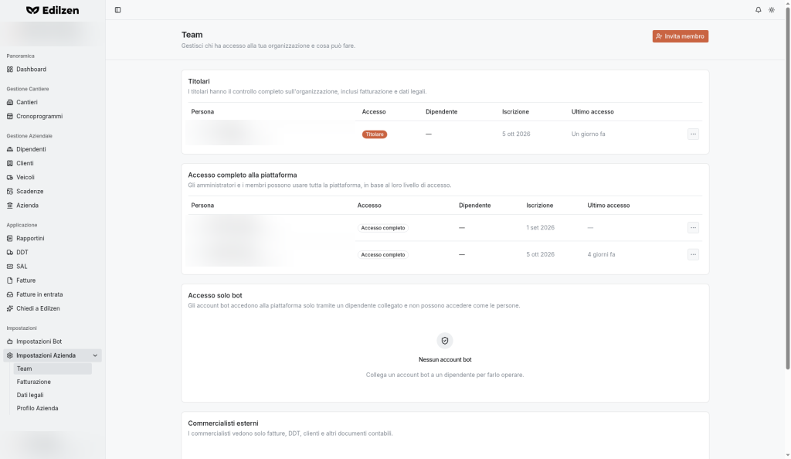
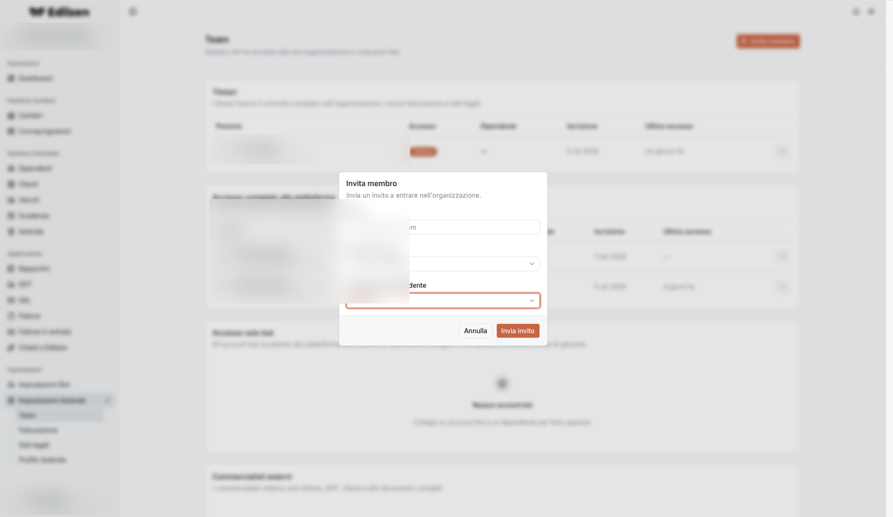

# Team e ruoli

**Percorso:** Impostazioni › Impostazioni Azienda › Team (`/settings/team`)

*"Gestisci chi ha accesso alla tua organizzazione e cosa può fare."*

{ .screenshot }

## Cosa trovi in questa pagina

- i quattro gruppi di accesso e le loro tabelle;
- invitare un membro;
- modificare l'accesso o rimuovere un membro.

## Gruppi di accesso

| Gruppo | Descrizione mostrata | Stato vuoto |
|--------|----------------------|-------------|
| **Titolari** | *I titolari hanno il controllo completo sull'organizzazione, inclusi fatturazione e dati legali.* | |
| **Accesso completo alla piattaforma** | *Gli amministratori e i membri possono usare tutta la piattaforma, in base al loro livello di accesso.* | |
| **Accesso solo bot** | *Gli account bot accedono alla piattaforma solo tramite un dipendente collegato e non possono accedere come le persone.* | *Nessun account bot — Collega un account bot a un dipendente per farlo operare.* |
| **Commercialisti esterni** | *I commercialisti vedono solo fatture, DDT, clienti e altri documenti contabili.* | *Nessun commercialista esterno — Invita il tuo commercialista per condividere i documenti contabili.* |

### Colonne

| Colonna | Contenuto |
|---------|-----------|
| **Persona** | Nome ed email |
| **Accesso** | Livello (es. *Titolare*, *Accesso completo*) |
| **Dipendente** | Scheda del [Personale](personale.md) collegata ("—" se nessuna) |
| **Iscrizione** | Data di ingresso |
| **Ultimo accesso** | Tempo dall'ultimo accesso (es. *4 giorni fa*) |
| **Azioni** | Menu ⋯: **Modifica accesso**, **Rimuovi** |

## Invitare un membro

{ .screenshot }

1. Premi **Invita membro** (in alto a destra).
2. Nella finestra *"Invia un invito a entrare nell'organizzazione."* compila:

    | Campo | Opzioni |
    |-------|---------|
    | **Email** | Indirizzo della persona (es. nome@esempio.com) |
    | **Livello di accesso** | **Accesso completo** (predefinito) · **Amministratore** · **Solo bot** · **Commercialista esterno** · **Titolare** |
    | **Collegamento dipendente** | **Nessuno** (predefinito) · **Dipendente esistente** · **Nuovo dipendente** |

3. Premi **Invia invito** (o **Annulla**).

### Quale livello scegliere

| Livello | Quando usarlo |
|---------|---------------|
| **Titolare** | Soci/proprietari che devono gestire anche fatturazione e dati legali |
| **Amministratore** | Chi gestisce la piattaforma per l'azienda |
| **Accesso completo** | Collaboratori che usano tutte le funzioni operative |
| **Solo bot** | Account che opera solo tramite bot per conto di un dipendente collegato |
| **Commercialista esterno** | Studio contabile: vede solo fatture, DDT, clienti e documenti contabili |

### Collegamento dipendente

- **Nessuno** – l'utente non è legato a una scheda del personale;
- **Dipendente esistente** – lo collega a una persona già presente in Personale;
- **Nuovo dipendente** – crea anche la scheda del personale.

Per gli account **Solo bot** il collegamento a un dipendente è necessario per farli operare.

## Modificare l'accesso

1. Nella riga del membro premi **⋯** (colonna *Azioni*).
2. Scegli **Modifica accesso** per cambiare il livello di accesso del membro.

## Rimuovere un membro

**⋯ › Rimuovi** nella riga del membro: la persona perde l'accesso all'organizzazione.
